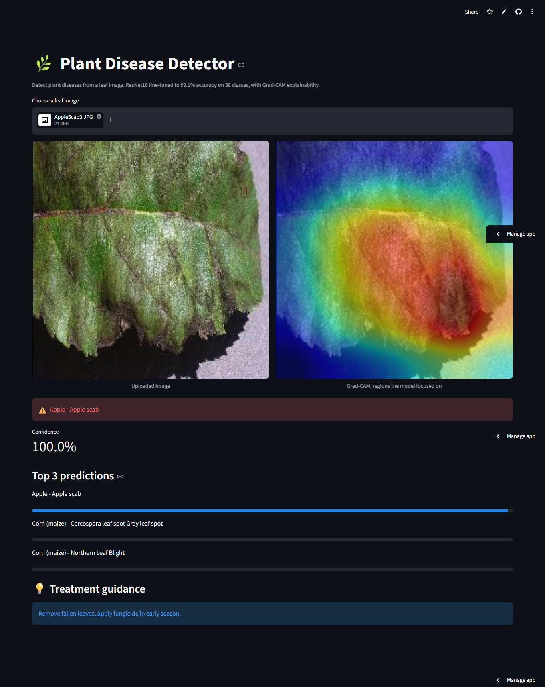
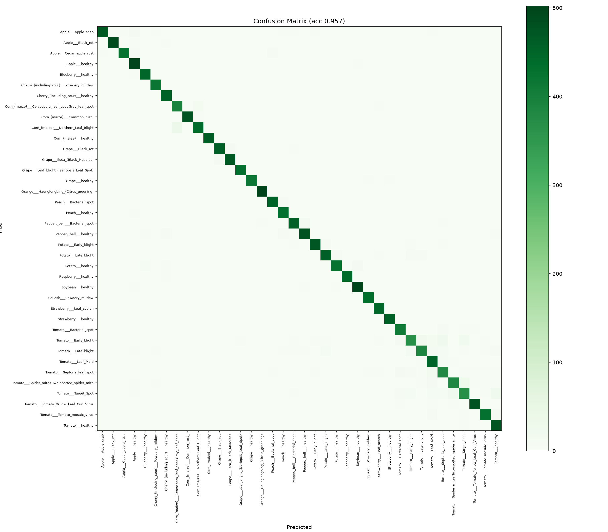

# 🌿 Plant Disease Detector

A deep learning web app that identifies plant diseases from a leaf image, with **Grad-CAM explainability** and treatment guidance. ResNet18 fine-tuned to **99.1% validation accuracy** across 38 classes.



## Features

- 🔍 Detects 38 plant/disease classes from a single leaf image
- 🎯 99.1% validation accuracy (two-phase transfer learning + fine-tuning)
- 🔥 Grad-CAM heatmaps showing which leaf regions drove the prediction
- 💡 Treatment guidance for each detected disease
- 📊 Top-3 predictions with confidence scores

## Confusion Matrix



## Tech Stack

Python 3.12 · PyTorch · torchvision · Streamlit · scikit-learn · matplotlib

## How It Works

1. Images are resized to 224×224 and normalized to ImageNet statistics.
2. **Phase 1:** a pretrained ResNet18 backbone is frozen; only the new classification head is trained.
3. **Phase 2:** the full network is unfrozen and fine-tuned at a 10x lower learning rate.
4. Grad-CAM hooks the final convolutional block to visualize model attention.

## Setup

```bash
python -m venv venv
venv\Scripts\activate          # Windows
pip install -r requirements.txt
